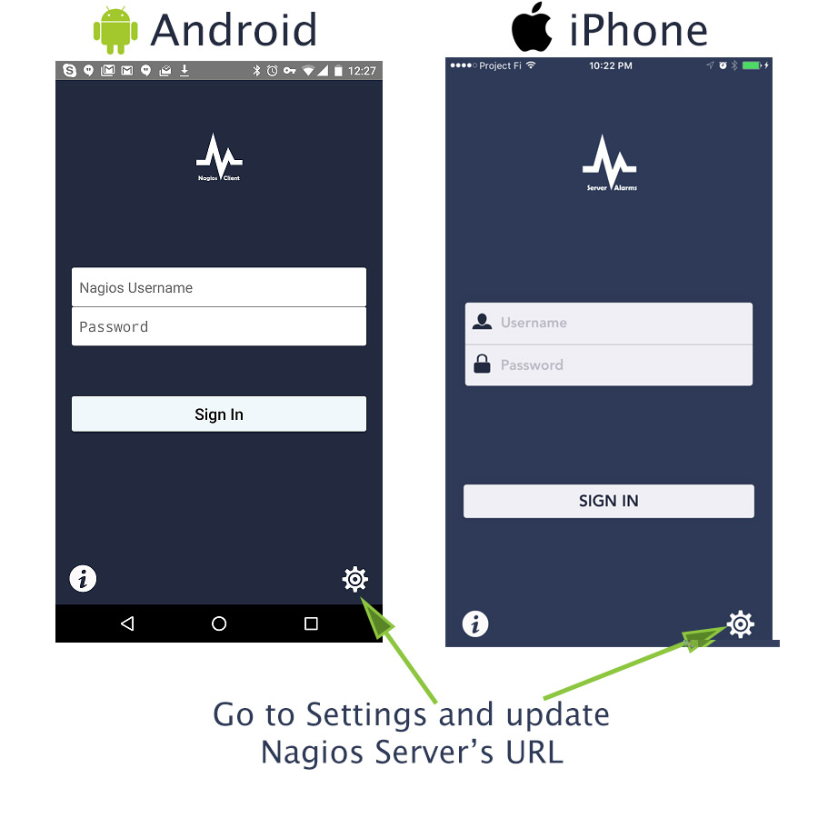
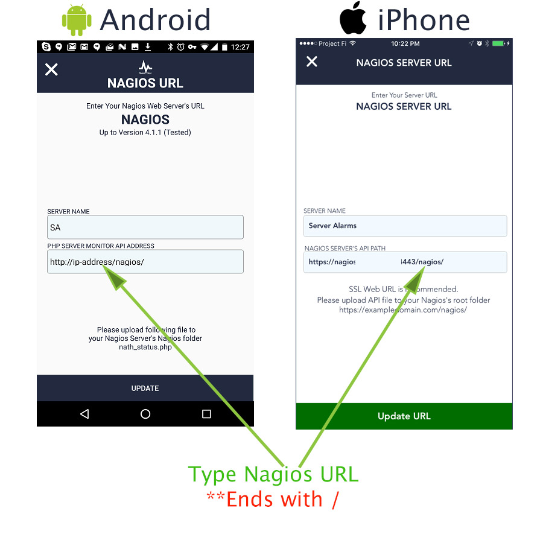

# Nagios Server

Nagios, now known as Nagios Core, is a free and open-source computer-software application that monitors systems, networks and infrastructure. Nagios offers monitoring and alerting services for servers, switches, applications and services.

## Prerequisites

* We are using `devops-network` docker network for all devops deployment.
* You need at least Docker Engine 17.06.0  and docker-compose 1.18 for this to work.

```bash
docker --version
docker-compose --version
```

## Create Docker image from Dockerfile

```bash
docker build -t akhilrajmailbox/nagios:4.3.2 . -f Docker/Dockerfile
```

## Create custom Docker network before deploying container (If the network is already created then ignore it)

*Note : Make sure that the subnet won't conflict with any other subnets*

```bash
docker network create --driver=bridge --subnet=172.31.0.0/16 devops-network
```

## Deploy SonarQube as Docker container

```bash
docker-compose -f docker-compose.yml up -d
```


## Working with nagios


* Login to nagios server

```bash
docker exec -it nagios /bin/bash
```

* Restarting nagios

```bash
docker-compose -f docker-compose.yml restart
```

* stopping/starting nagios

```
docker-compose -f docker-compose.yml stop/start
```

* check the logs of nagios server

```bash
docker logs -f nagios
```


## Environment variables

This image can be configured by means of environment variables, that one can set on a `Deployment`.

| Variable Name | Default Value |   Description |
|---------------|---------------|---------------|
| USER_PASSWORD | MyroUserCreds |   Readonly user for Nagios webUI  |
| SMTP_SERVER | smtp.gmail.com |    smpt server for sending Alert mail  | 
| SMTP_PORT | 587 | smtp port number for the "SMTP_SERVER"  |
| SMTP_USERNAME | -- |  Your smtp username (mail address)   |
| SMTP_PASSWORD | -- |  Password for the "SMTP_USERNAME"    |
| NAGIOS_MAIL_SENDER | PagerDuty < mymail@gmail.com > |   The receiver will see the lert mail comes from this sender  |
| LOCAL_MONITOR | N |    for adding the localhost to the monitoring list, variable Value must be "Y / y" for monitor the localhost(The container) by the nagios    |


**NOTE :**

 *	port 80		>>	for web_ui access
 *	port 5666	>>	for nrpe connection between nagios server and client machines which being monitoring

web_ui :: `http://host-ip:9999/nagios`


**Admin Credentials**

```
admin		=		nagiosadmin
password	=		you have to run the command "AdminPass" in the nagios container to get the admin password. This passowrd will change if the container get redeployed, so no need to save this password anywhere.
```

**Readonly User Credentials**

```
user		=		nagiosuser
password	=		USER_PASSWORD
```


## Client machine configurations for nagios

**In client machine, run this commands in order to configure nrpe and nagios client (tested with ubuntu and centos machines)**

```
./nrpeSetup.sh
```

or 

```
curl -L https://gist.githubusercontent.com/akhilrajmailbox/6779995f19e176df3f67d667fd16aaa1/raw/nrpeSetup.sh | bash
```

*Give docker permission nagios user for checking container status*

```bash
sudo usermod -aG docker nrpe
id nrpe
```

*IMPORTANT ::*

*for using 'check_nrpe' you need to configure in remote machine also, do not configure with 'argument enable option in remote machine' (security issue)*

*the below example is showing with argument enable option in the remote achine plugin, but it is not recommended*

## nrpe Plugin configurations with an example

`Example Plugin name :  check_vpn`

### Nagios client side configurations

* create a shell script with name `check_vpn`

```
#!/bin/bash
VPN_IPAddress=$1
if ping -c1 $VPN_IPAddress > /dev/null; then
                echo "OK - VPN is up"
                exit 0
        else
                echo "CRITICAL - VPN is down"
                exit 2
fi
```

* update the nrpe.cfg

```
dont_blame_nrpe=1
command[my_vpn]=/usr/lib/nagios/plugins/check_vpn $ARG1$
```

* add the scripts to `plugins` folder

```
cd /usr/lib/nagios/plugins/
chmod a+x check_vpn/usr/lib/nagios/plugins/check_vpn
service nagios-nrpe-server restart
```

* test the plugin

```
/usr/lib/nagios/plugins/check_vpn 159.232.1.1
```

### Nagios server side configurations

* configure a custom command entry to use check_vpn script / plugin in the remote machine

```
define command{
        command_name    check_vpn_server
        command_line    $USER1$/check_nrpe -H $ARG1$ -c $ARG2$ -a $ARG3$
        }
```

* example :

```
 -H $ARG1$     >>  host where need to run
 -c $ARG2$     >>  command, here (my_vpn)
 -a $ARG3$     >>  argument for my_vpn
 example       >>  check_command                   check_vpn_server!192.168.0.125!my_vpn!159.232.1.1
```


## Debugging mail configuration

If you are facing any issue in the mail configuration / not able to send mail, please try to send mail manually from the terminal

```
apt install mailutils -y
echo "This is message body" | mail -s "from k8s haha" akhilraj@mycompany.com
mailq
postsuper -d ALL
tail -f  /usr/local/nagios/var/nagios.log
```


## ServerAlarms apps for ios and android

This PHP API script reads Nagios status.dat file and return the JSON result. This API is desinged for Nagios Client unofficial Nagios status monitoring app.  Thanks to [asuknath](https://github.com/asuknath/Nagios-Status-JSON)


### Step 1

Upload **nath_status.php** to your Nagios web root folder.

Nagios Core's default Web Root folder Web Root Folder - Centos & Ubuntu

```
/usr/local/nagios/share/
```

### Step 2

Edit **nath_status.php.** *You can use your favourite text editor*

Change status.dat file's path according to your Nagios Server configuration.

```
vi /usr/local/nagios/share/nath_status.php
$statusFile = '/usr/local/nagios/var/status.dat';
```

Use following command to find status.dat location.

```
find / -name status.dat
```

### Step 3

**Download and Configure iPhone or Android Server Alarms Nagios Client**

[Nagios Client](https://play.google.com/store/apps/details?id=com.serveralarms.nagios&hl=en)

* Go to settings



* Update URL




## Reference Docs

[Nagios basics](http://www.tuxradar.com/content/nagios-made-easy)

[Installaiton 1](https://www.digitalocean.com/community/tutorials/how-to-install-nagios-4-and-monitor-your-servers-on-ubuntu-14-04)

[Installation 2](https://www.digitalocean.com/community/tutorials/how-to-install-and-setup-postfix-on-ubuntu-14-04)

[Confifguration 1](http://www.tutorialspoint.com/articles/how-to-configure-nagios-server-for-monitoring-apache-server)

[Configuration 2](http://amar-linux.blogspot.in/2012/08/nagios-monitoring-custom.html)

[Themes and Skin 1](https://www.techietown.info/2017/03/installchange-nagios-theme/)

[Themes and Skin 2](https://exchange.nagios.org/directory/Addons/Frontends-(GUIs-and-CLIs)/Web-Interfaces/Themes-and-Skins)

[Read only secondary user 1](https://serverfault.com/questions/436886/nagios-is-it-possible-to-create-view-only-users-and-let-them-view-only-speci)

[Read only secondary user 2](https://github.com/asuknath/Nagios-Status-JSON)

[Nagios Object Definitions 1](https://assets.nagios.com/downloads/nagioscore/docs/nagioscore/3/en/objectdefinitions.html?_ga=2.92039834.146004542.1532584157-1578007940.1531140260)

[Nagios Object Definitions 2](https://assets.nagios.com/downloads/nagioscore/docs/nagioscore/3/en/cgis.html#extinfo_cgi)

[Custom Plugins 1](https://www.unixmen.com/write-nagios-plugin-using-bash-script/)

[Custom Plugins 2](http://www.yourownlinux.com/2014/06/how-to-create-nagios-plugin-using-bash-script.html)

[Custom Plugins 3](https://www.howtoforge.com/tutorial/write-a-custom-nagios-check-plugin/)

[ServerAlarms apps for ios and android](https://exchange.nagios.org/directory/Addons/Frontends-%28GUIs-and-CLIs%29/Mobile-Device-Interfaces/Nagios-Client--2D-Status-Monitor/details)

[Turning 1](http://nagios.manubulon.com/traduction/docs25en/xodtemplate.html)

[Turning 2](http://nagios.manubulon.com/traduction/docs25en/tuning.html)

[Nagios API](https://labs.nagios.com/2014/06/19/exploring-the-new-json-cgis-in-nagios-core-4-0-7-part-1/)
